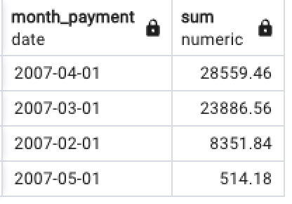
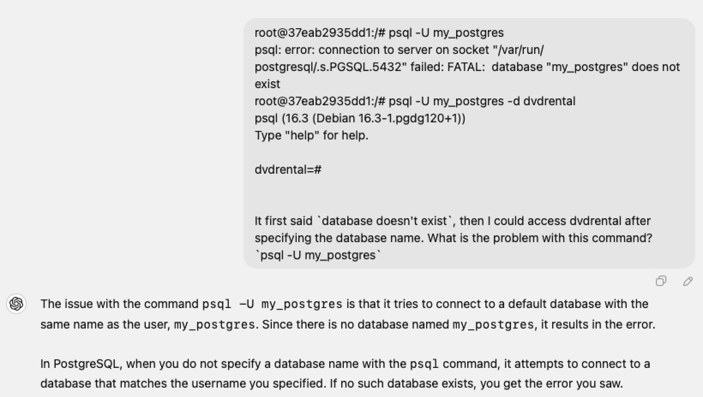

# Content
- Introduction to SQL
- SQL Categories
  - DQL
  - DML
  - DDL
  - DCL
  - TCL
- SQL Clauses
- SQL Functions
  - Aggregate Functions
  - String Functions
  - Date Functions
  - Numeric Functions
  - Conversion Functions
  - Conditional Functions
  - Mathematical Functions
  - System Functions
- Other SQL Concepts
  - Operators
  - Indexes
  - Constraints
  - Views
  - Stored Procedures and Functions
  - Triggers
  - Transactions
- SQL Service INSTALLATION
- Other
- Hierarchical Structure of Databases


# Introduction to SQL

## `SQL` vs `NoSQL`

- SQL: `Structured Query Language`, used for storing `Structured Data`
- NoSQL: `Not Only SQL`, used for storing `Unstructured Data`. It is a family of database management systems designed to handle the unique challenges posed by Big Data.


## SQL Standard
`ANSI` SQL is the standard for the SQL. It is used by "American National Standards Institute"


# SQL Categories
There are four categories of SQL:
- DQL (Data Query Language)
  - SELECT

- DML (Data Manipulation Language)
  - INSERT
  - UPDATE
  - DELETE

- DDL (Data Definition Language)
  - CREATE TABLE
  - ALTER TABLE
  - DROP TABLE
  - TRUNCATE TABLE

- DCL (Data Control Language)
  - GRANT
  - REVOKE

- TCL (Transaction Control Language)
  - BEGIN
  - COMMIT
  - ROLLBACK


## DQL (Data Query Language)

### SELECT

```sql
select last_name last_nm, first_name as first_nm
from public.actor;

-- `as` is used to set alias, which can be omitted
```

#### DISTINCT
Ensures that the result set contains unique rows by eliminating duplicates.

```sql
SELECT DISTINCT film_id, store_id from inventory;
```

> **⚠**️ Be careful when using `DISTINCT` with more than one column!
If there is only one column, using or not using parenthesis is the same.
```sql
SELECT DISTINCT film_id from inventory;
```
is the same as:
```sql
SELECT DISTINCT(film_id) from inventory;
```

However, if there are more than one columns, the use of () is wrong:
```sql
-- this is the correct way
SELECT DISTINCT film_id, store_id from inventory;

-- this is the wrong way
SELECT DISTINCT(film_id, store_id) from inventory; -- notice there is no space between `DISTINCT` and `(`

-- this one is not wrong, yet will return a series of tuples
SELECT DISTINCT (film_id, store_id) from inventory;
```

The series of tuples is like this
```plaintext
"["1","1"]"
"["1","2"]"
"["2","2"]"
"["3","2"]"
"["4","1"]"
"["4","2"]"
"["5","2"]"
"["6","1"]"
"["6","2"]"
"["7","1"]"
"["7","2"]"
"["8","2"]"
"["9","1"]"
"["9","2"]"
"["10","1"]"
"["10","2"]"
"["11","1"]"
"["11","2"]"
"["12","1"]"
"["12","2"]"
"["13","2"]"
"["15","1"]"
"["15","2"]"
"["16","1"]"
"["16","2"]"
"["17","1"]"
"["17","2"]"
"["18","1"]"
"["18","2"]"
"["19","1"]"
"["19","2"]"
"["20","1"]"
...
"["1000","1"]"
```

`"["1","1"]"` means that there is one or more rows where `film_id` is `1` and `store_id` is `1`, the `DISTINCT` command will only return one row, hence `"["1","1"]"`.


#### Sub-queries
- Scalar Sub-queries: Return a single value
- Row Sub-queries: Return a single row
- Table Sub-queries: Return a single table
- Correlated Sub-queries: Refer to columns in the outer query
- Non-correlated Sub-queries: Independent of the outer query

> Using an alias defined in the SELECT clause directly in the WHERE clause will result in an error, because it's not allowed in query. To achieve the same result, use sub-queries.


#### CASE WHEN
Find the percentage difference in payment amounts from March to April 2007 (method 1):
```sql
select
  sum(case when date_trunc('Month', payment_date) = '2007-03-01' then amount else 0 end) as march_payment,
  sum(case when date_trunc('Month', payment_date) = '2007-04-01' then amount else 0 end) as april_payment,
  ((sum(case when date_trunc('Month', payment_date) = '2007-04-01' then amount else 0 end) - sum(case when date_trunc('Month', payment_date) = '2007-03-01' then amount else 0 end)) / sum(case when date_trunc('Month', payment_date) = '2007-03-01' then amount else 0 end)) * 100 as percentage_difference
from payment;
```


#### CTE (Common Table Expression)
Find the percentage difference in payment amounts from March to April 2007 (method 2):
```sql
with monthly_payments as (
  select
    date_trunc('Month', payment.payment_date) as month_payment,
    sum(payment.amount) as total_payment
  from payment
  group by 1
)
select
  m1.total_payment as march_payment,
  m2.total_payment as april_payment,
  ((m2.total_payment - m1.total_payment) / m1.total_payment) * 100 as percentage_difference
from monthly_payments m1
join monthly_payments m2 on m1.month_payment='2007-03-01' and m2.month_payment='2007-04-01';
```

Method 3, using `CASE WHEN` and `CTE` together
```sql
with monthly_payments as (
  select
    sum(case when date_trunc('Month', payment_date) = '2007-03-01' then amount else 0 end) as march_payment,
    sum(case when date_trunc('Month', payment_date) = '2007-04-01' then amount else 0 end) as april_payment
  from payment
)
select
  march_payment,
  april_payment,
  ((april_payment - march_payment) / march_payment) * 100 as percentage_difference
from monthly_payments;
```


## DML (Data Manipulation Language)

### INSERT


### UPDATE


### DELETE
```sql
delete from staff_backup where staff_id=2;
```


## DDL (Data Definition Language)
- CREATE
- ALTER
- TRUNCATE
- DROP

### CREATE

#### CREATE a new table
```sql
CREATE TABLE film (
    film_id INTEGER PRIMARY KEY DEFAULT nextval('film_film_id_seq'::regclass),
    title VARCHAR(255) NOT NULL,
    description TEXT,
    release_year YEAR,
    language_id SMALLINT NOT NULL,
    rental_duration SMALLINT NOT NULL DEFAULT 3,
    rental_rate NUMERIC(4,2) NOT NULL DEFAULT 4.99,
    length SMALLINT,
    replacement_cost NUMERIC(5,2) NOT NULL DEFAULT 19.99,
    rating MPAA_RATING DEFAULT 'G'::MPAA_RATING,
    last_update TIMESTAMP WITHOUT TIME ZONE NOT NULL DEFAULT now(),
    special_features TEXT[],
    fulltext TSVECTOR NOT NULL,
    CONSTRAINT fk_language_id FOREIGN KEY (language_id) REFERENCES language(language_id) ON UPDATE CASCADE ON DELETE RESTRICT
);
```

#### CREATE a new table from an existing table - Duplicate an existing table
```sql
CREATE table staff_backup as 
SELECT * FROM staff;

-- this means create a new blank table `staff_backup` then take everything from `staff` table and put it into `staff_backup`
```


#### CREATE a new database
```sql
psql -U my_postgres -d postgres -c "CREATE DATABASE dvdrental OWNER my_postgres;"
```


#### RESTORE a database from a backup file

```sql
pg_restore -U my_postgres -d dvdrental --no-owner /var/lib/postgresql/data/dvdrental.tar
```

> NOTE: Why do we need to specify `--no-owner` in the command?
This is what the owner looks like:
```plaintext
root@37eab2935dd1:/var/lib/postgresql/data# ls -al
total 2908
drwx------ 19 postgres postgres    4096 Aug  7 16:32 .
drwxr-xr-x  1 postgres postgres    4096 Jul 24 01:25 ..
drwx------  7 postgres postgres    4096 Aug  7 15:02 base
-rw-r--r--  1      501 dialout  2835456 Aug  7 15:02 dvdrental.tar
drwx------  2 postgres postgres    4096 Aug  8 01:18 global
drwx------  2 postgres postgres    4096 Aug  7 14:55 pg_commit_ts
```

The database is running in a docker container. The dvdrental.tar file was sent from the host to the container, hence having the owner of `501` and group of `dialout`.
To avoid possible conflicts when restoring the database, we need to specify `--no-owner` in the command. `--no-owner` ignores the ownership of database objects.


### ALTER


### TRUNCATE


### DROP

### Drop all tables from a database
```sql
-- PostgreSQL
psql -U my_postgres -d dvdrental -c "DO \$\$ DECLARE r RECORD; BEGIN FOR r IN (SELECT tablename FROM pg_tables WHERE schemaname = 'public') LOOP EXECUTE 'DROP TABLE IF EXISTS public.' || r.tablename || ' CASCADE'; END LOOP; END \$\$;"
```

### DROP the `dvdrental` database
1. Terminate connections to the database
```sql
psql -U my_postgres -d postgres -c "SELECT pg_terminate_backend(pid) FROM pg_stat_activity WHERE datname = 'dvdrental';"
```

> NOTE: the database name `-d postgres` has to be specified, otherwise the system will try to look for the same database name as that of the username (`my_postgres` in this case), which will result in a database not found error, since there is no `my_postgres` database.


2. Drop the database
```sql
psql -U my_postgres -d postgres -c "DROP DATABASE dvdrental;"
```


## DCL (Data Control Language)


## TCL (Transaction Control Language)


# SQL Clauses

## WHERE
used for filtering
```sql
select * from public.actor where first_name = 'Boom Boom';
```


## AND / OR
used to combine multiple conditions
```sql
select * from public.actor where first_name = 'Boom Boom' and `size` = 'E';
```

It's strongly suggested to use parenthesis to group multiple conditions
```sql
select * from film
where (rating = 'PG' OR rating = 'G') AND rental_rate <= 3.99;
```


## IN
```sql
select * from film
where rating in ('PG', 'G') AND rental_rate <= 3.99;
```


## BETWEEN ... AND
```sql
select * from film
where rating in ('PG', 'G') AND rental_rate between 2.99 and 3.99; -- between 2.99 and 3.99 means "greater than or equal to 2.99 and less than or equal to 3.99"
```


## LIKE
find fuzzy matches
```sql
select * from film where description like '%Drama%';
```


## ORDER BY
used to sort
```sql
select * from rental order by rental_date;
```


## GROUP BY
```sql
select customer_id, sum(amount) total_paid_by_customer
from payment
group by 1  -- this is the same as `group by customer_id`
order by 2; -- this is the same as `order by total_paid_by_customer`
```


## HAVING
```sql
select sum(amount), date(payment_date)
from payment
group by 2
having sum(amount) > 300;
```

NOTE: do not use `number` in the `having` clause


## JOIN
Three scenarios:
- Join criteria is not met
- Join criteria is met once
- Join criteria is met more than once


> **⚠️** JOINING ISSUEs:

Assumed that:
- Table A has two duplicated rows
- Table B also has two duplicated rows (and the values are same as those in Table A) 

<span style="color:red">**⚠️** What happens if we try to join these two tables? </span>

There will be <span style="color:red">four duplicated rows </span> in the joined table!!!

> If `n` rows from one table match with `m` rows in another table, the joining result is `n*m` rows. It's multiplicative.

### JOIN or INNER JOIN
Compared to VLOOKUP in spreadsheet:
INNER JOIN is used in databases to combine data from two or more tables based on a shared key, while VLOOKUP is a function in spreadsheets used to search for a value in a specified column and return a corresponding value from a different column.

`join` or `inner join` only returns rows that have matching values in both tables, i.e., the criteria is met.

#### Multiple INNER JOIN
```sql
select c.name, tb2.number_of_films
from category c
inner join (
	select tb.category_id, count(distinct row(film_id, rating)) as number_of_films
	from (
		select fc.category_id, f.film_id, f.rating
		from film_category fc
		inner join film f on fc.film_id = f.film_id
		where f.rating = 'G'
	) tb
	group by 1
) tb2 on c.category_id=tb2.category_id
order by 2 desc;
```

This can be shortened to:

```sql
select c.name, count(distinct f.film_id)
from film f
inner join film_category fc on f.film_id = fc.film_id
inner join category c on fc.category_id = c.category_id
where f.rating = 'G'
group by 1
order by 2 desc;
```


### OUTER JOIN

#### LEFT JOIN
```sql
select rental_id, customer_id, rental.staff_id, concat(first_name, ' ', last_name) as staff_name
from rental
left join staff_backup on rental.staff_id = staff_backup.staff_id;
```


#### RIGHT JOIN


#### FULL OUTER JOIN


#### CROSS JOIN


#### UNION 
To use `UNION`, each table must have the same number of columns and data types (columns can be different, but data types must be the same).

`UNION` will remove duplicated rows and show only unique ones.

> NOTE: NULL can be compatible with other data types.

```sql
select rental_id, customer_id, rental_date from rental_1158_1159
union
select rental_id, null as null_val, rental_date from rental_1158_1160;

-- This will also work
```


#### UNION ALL
Like `UNION`, to use `UNION ALL`, each table must have the same number of columns and data types (columns can be different, but data types must be the same).

Unlike `UNION`, `UNION ALL` will show duplicated rows


# SQL Functions

## Aggregate Functions

### COUNT()
return the number of rows
```sql
select count(*) from public.actor;

-- or
select count(1) from public.actor;
```

> `COUNT(*) ... AS distinct_rows` return distinct rows, taking all columns into account

```sql
select count(*)
from (
  select f.film_id, f.title, f.rating, count(fa.actor_id)
  from film f
  inner join film_actor fa on f.film_id = fa.film_id
  where f.rating = 'PG'
  group by f.film_id, f.title, f.rating
) as distinct_rows;
```


### SUM()


### AVG()


### MIN()


### MAX()


### GROUP_CONCAT() (or STRING_AGG())


## Date Functions

- Use `between ... and ...` to filter dates
```sql
select * from rental where rental_date between '2005-05-24' and '2005-05-25';
```

- Use comparison operators
```sql
select * from rental where rental_date > '2005-05-24';
```

remember the date format is: `YYYY-MM-DD`


### DATE()
```sql
select rental_date rental_datetime, date(rental_date) rental_date from rental;
```


### EXTRACT()
```sql
select rental_date rental_datetime, extract('Year' from rental_date) rental_year from rental;
-- Note: 'Year' or year is fine

select distinct extract(year from rental_date) from rental;

select distinct extract(month from rental_date) from rental;
```

We can extract 'Year', 'Month', 'Quarter', 'Week', 'Day', 'Hour', 'Minute', 'Second' from a date using `extract` function.


### Calculated Date Field
```sql
select rental_date, return_date, return_date - rental_date rental_period from rental;

select rental_date, return_date, extract(day from return_date - rental_date) rental_period_as_days from rental;
```


### DATE_TRUNC()
get the 1st day of the week, month, quarter, or year
```sql
select rental_date, date_trunc('Quarter', rental_date) rental_quarter from rental;
```

```sql
select date(date_trunc('Month', payment_date)) as month_payment, sum(amount)
from payment
group by month_payment
order by sum(amount) desc;
```

OUTPUT:



### CURRENT_DATE
a keyword to return the current date


## String Functions

### CONCAT()
```sql
select concat(first_name, ' ', last_name) from actor;
-- or
select first_name || ' ' || last_name from actor; -- this should belong to Operators section

create table staff_duplicate AS
select staff_id, concat(first_name, ' ', last_name) as staff_name
from staff

union all

select staff_id, concat(first_name, ' ', last_name) as staff_name
from staff
where staff_id=2
;
```


### SUBSTRING() or SUBSTR()
```sql
select title, substr(title, 2, 3) from film;
```


### UPPER() and LOWER()
```sql
select title, upper(title) from film;
select title, lower(split_part(title, ' ', 2)) from film;
```


### LEFT() and RIGHT()
```sql
select title, right(title, 2) from film;
```


## Numeric Functions


## Conversion Functions

### CAST()
```sql
-- change the data type from integer to float or real 
select cast(count(*) as decimal) / (select count(*) from film) as proportion_g_pg
from film
where rating in ('PG', 'G');
```


## Conditional Functions

### COALESCE()
Take a lists of values and return the first non-null value.

```sql
select coalesce(address2, district), address2, district from address;
-- If the address2 is null, it will take the district. It will check like this line by line to form the `coalesce` column.

select coalesce(address2, 'unknown') from address;
-- If the address2 is null, it will take the `unknown` value.
```

> NOTE: In SQL, `null` and `blank` are different. `null` is a special value in SQL.


## Mathematical Functions


## System Functions


# Other SQL Concepts

## Operators

### Arithmetic Operators
`+`, `-`, `*`, `/`, `**`, `%`

```sql
select film_id, title, round(rental_rate / rental_duration, 2) as rental_rate_per_day
from film;
```


### Comparison Operators
`=`, `!=` or `<>`, `>`, `<`, `>=`, `<=`


### Logical Operators
`AND`, `OR`, `NOT`


### String Operators
`||` (or `+` in some databases for concatenation)


## Indexes
Create indexes to improve the performance of queries:
```sql
CREATE INDEX film_fulltext_idx ON film USING GIST (fulltext);
CREATE INDEX idx_fk_language_id ON film (language_id);
CREATE INDEX idx_title ON film (title);
```


## Constraints
- PRIMARY KEY: Uniquely identifies records
- FOREIGN KEY: Ensures referential integrity
- UNIQUE: Ensures all values are unique
- NOT NULL: Ensures a column cannot have NULL values
- CHECK: Ensures values meet a condition


## Views
`CREATE VIEW`: Create a virtual table based on a query


## Stored Procedures and Functions
- Stored Procedures: Precompiled SQL code that can be executed as a unit
- User-Defined Functions: Custom functions created by users


## Triggers
`CREATE TRIGGER`: Automatically perform actions in response to events

```sql
CREATE TRIGGER film_fulltext_trigger
    BEFORE INSERT OR UPDATE ON film
    FOR EACH ROW
    EXECUTE FUNCTION tsvector_update_trigger('fulltext', 'pg_catalog.english', 'title', 'description');

CREATE TRIGGER last_updated
    BEFORE UPDATE ON film
    FOR EACH ROW
    EXECUTE FUNCTION last_updated();
```


## Transactions
- `BEGIN TRANSACTION`: Start a transaction
- `COMMIT`: Commit changes
- `ROLLBACK`: Undo changes


# SQL Service INSTALLATION

## PostgreSQL

### Create docker containers for `postgres` and `pgadmin4` services using docker compose
Docker compose file: `docker-compose.yml`
```yml
version: '3.8'

services:
  postgres:
    image: postgres:latest
    restart: always
    environment:
      POSTGRES_USER: my_postgres
      POSTGRES_PASSWORD: MyLocalPostgresPassword
      POSTGRES_DB: my_local_postgres
    ports:
      - "5433:5432"
    volumes:
      - postgres_data:/var/lib/postgresql/data

  pgadmin:
    image: dpage/pgadmin4
    restart: always
    environment:
      PGADMIN_DEFAULT_EMAIL: monireach.tang@gmail.com
      PGADMIN_DEFAULT_PASSWORD: MonireachSecuredPassword
    ports:
      - "8081:80"
    depends_on:
      - postgres

volumes:
  postgres_data:
```


### Use the `pgadmin` service to connect to the `postgres` service
In the browser, go to `http://localhost:8081`

Login with `monireach.tang@gmail.com` and `MonireachSecuredPassword`

Click on “Add New Server” (in the home interface)

Fill in teh details:
- Name: PostgreSQL
- Connection:
    - Host name/address: postgres
    - Port: 5432
    - Maintenance database: my_local_postgres
    - Username: my_postgres
    - Password: MyLocalPostgresPassword


### PostgreSQL error
After restoring the database using the interface and checking for the database in the docker container, we get the following error:




## Administrative Commands (DBMS-Specific)

> DBMS stands for Database Management System.

### PostgreSQL (psql commands):
- `\l`: List all databases 
- `\c` dvdrental: Connect to a database called `dvdrental`
- `\dt`: List all tables in the database
- `\d` film: Describe a table in the database called `film`
- `\du`: List all users
- `\q`: Quit


### MySQL (mysql commands):
- `SHOW DATABASES`: List all databases
- `USE dvdrental`: Connect to a database called `dvdrental`
- `SHOW TABLES`: List all tables in the database
- `DESCRIBE film`: Describe a table in the database called `film`
- `SHOW GRANTS`: List all users
- `EXIT`: Quit


# Other

> **💡** PostgreSQL doesn't recognize the backtick (`). To handle identifiers that include spaces, special characters, or are case-sensitive, use double quotes (") instead.


# Hierarchical Structure of Databases

## Types of Databases

### Relational Database Management System (RDBMS)
1. SQL Variants
- MySQL
- PostgreSQL
- Oracle SQL (PL/SQL)
- Microsoft SQL Server (T-SQL)
- IBM Db2 SQL
- SQLite
- MariaDB
- PL/pgSQL (PostgreSQL)
- PL/SQL (Sybase)
- SAP HANA SQL
- Teradata SQL

2. Characteristics
- Data is stored in `tables` (rows and columns)
- Strong `ACID compliance`
- `SQL` is the primary query language


### NoSQL Databases
1. `Types` of NoSQL Databases
- `Key-value` Stores: ex, `Redis`, `Amazon DynamoDB`
- `Document` Stores: ex, `MongoDB`, `CouchDB`
- `Columnar` Databases: ex, `Apache Cassandra`, `HBase`
- `Graph` Databases: ex, `Neo4j`, `Amazon Neptune`

2. Characteristics
- Designed for `specific use cases` (e.g., high scalability, unstructured data)
- Data models vary (e.g., key-value pairs, documents, wide-column)
- No fixed schema, typically schema-less


## Database Architectures

### Cloud Databases
1. Characteristics
- Managed by cloud service providers (e.g., `AWS`, `Azure`, `Google Cloud`)
- Examples: `Amazon RDS` (`Relational`), `Google BigQuery` (`Data Warehousing`), `Amazon DynamoDB` (`NoSQL`), Teradata Cloud

2. Advantages
- Scalability, automatic backups, and high availability
- Pay-as-you-go pricing model

### In-Memory Databases
1. Characteristics
- Data is stored in memory (RAM) rather than disk
- Examples: `Redis`, `SAP HANA`

2. Advantages
- Extremely fast read/write operations
- Suitable for real-time analytics and caching

### Columnar Databases
1. Characteristics
- Data is stored in columns instead of rows
- Optimized for read-heavy operations and analytical queries
- Examples: `Apache Cassandra` (`NoSQL`), Amazon Redshift (`Data Warehousing`), `Teradata` (`RDBMS`/`Columnar`)

2. Advantages
- Efficient for querying large datasets
- Reduces the amount of data read from disk


## Data Warehousing

### Characteristics
1. Purpose
- Designed for `reporting` and `data analysis`
- Stores large volumes of historical data from various sources

2. Architecture
- Often uses columnar storage (e.g., `Amazon Redshift`, `Google BigQuery`)
- Can be `cloud-based` or `on-premises`

3. Examples
- Amazon Redshift (Cloud Columnar DB, SQL-based)
- Google BigQuery (Cloud Columnar DB, SQL-based)
- Snowflake (Cloud Data Warehouse)
- Teradata (On-premises or Cloud Data Warehouse, SQL-based)
- Apache Hive (SQL-Like Query Language for Hadoop-based Data Warehousing)


## Summary of Relationships

- RMDBMS and NoSQL are the two main types of databases, each with specific characteristics and use cases.
- SQL Variants are specific to RDBMS, while NoSQL Databases are diverse and tailored to different data models (e.g., key-value, document, columnar)
- Database Architectures refer to how databases are implemented and deployed (e.g., Cloud, In-Memory, Columnar)
- Data Warehousing is a specific use case often associated with columnar databases and can be implemented on various architectures, especially in the cloud

## Visual Example of Hierarchy and Relationships
1. Database Types
- Relational (RDBMS)
  - SQL Variants
  - ACID Compliance
- NoSQL
  - Key-Value, Document, Columnar, Graph
  - Schema-less

2. Database Architectures
- Cloud (Can be RDBMS, NoSQL, or Data Warehousing)
- In-Memory (RDBMS, NoSQL)
- Columnar (RDBMS, NoSQL, Data Warehousing)

3. Data Warehousing
- Cloud-based Columnar Databases
- SQL-based for analysis


## Teradata and Apache Hive in Context
- Teradata: An `RDBMS` optimized for `data warehousing`, often using a `columnar architecture`, available `both on-premises and in the cloud`.

- Apache Hive: A `data warehousing` solution that uses a SQL-like query language, designed for querying and managing large datasets `stored in a Hadoop-based distributed storage system`.
> Hadoop is an open source framework based on Java that manages the storage and processing of large amounts of data for applications.